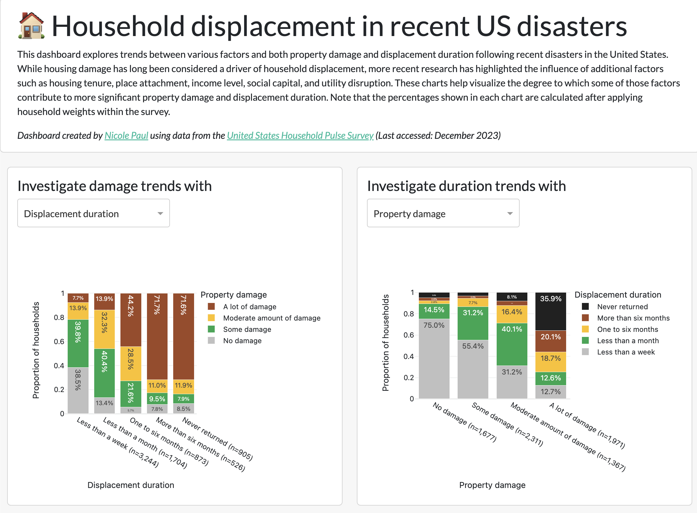

# Household displacement in recent US disasters

This repository houses code for a simple dashboard that visualizes data from the [United States Household Pulse Survey](https://www.census.gov/programs-surveys/household-pulse-survey.html). The trends of property damage and of displacement duration can be compared against a range of other factors (e.g., demographics, housing considerations, mental health). The dashboard is a companion to an open access article proposing predictive models to capture household displacement and return after disasters:

> Paul, N., Galasso, C., Baker, J., & Silva, V. (2025). A predictive model for household displacement duration after disasters. *Risk Analysis*, 1–29. https://doi.org/10.1111/risa.17710

**See the live dashboard at: [https://hps.nicolepaul.io/](https://hps.nicolepaul.io/)**

 

To run locally, first install the dependencies.

    pip install -r requirements.txt 

After the requirements are installed, you can deploy locally:

    python app.py