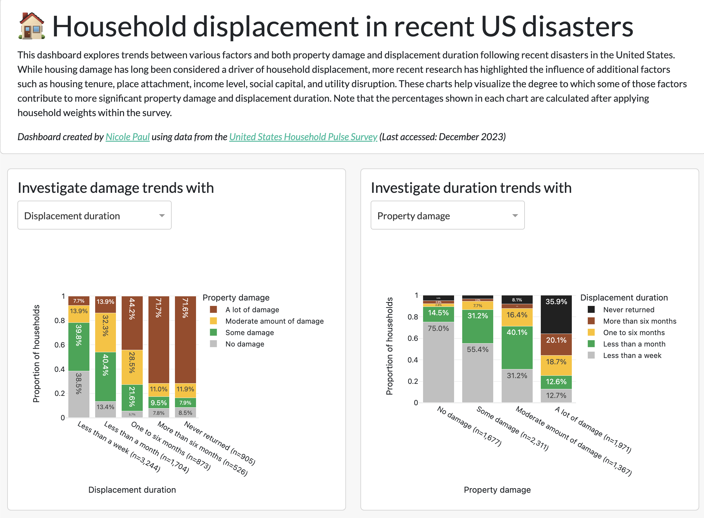

# Household displacement in recent US disasters

This repository houses code for a simple dashboard that visualizes data from the [United States Household Pulse Survey](https://www.census.gov/programs-surveys/household-pulse-survey.html). The trends of property damage and of displacement duration can be compared against a range of other factors (e.g., demographics, housing considerations, mental health). The dashboard is a companion to an open access article proposing predictive models to capture household displacement and return after disasters:

> Paul, N., Galasso, C., Baker, J., & Silva, V. (2025). A predictive model for household displacement duration after disasters. *Risk Analysis*, 1–29. https://doi.org/10.1111/risa.17710

**See the live dashboard at: [https://hps.nicolepaul.io/](https://hps.nicolepaul.io/)**

 

To run locally, first install the dependencies.

    pip install -r requirements.txt 

After the requirements are installed, you can deploy locally:

    python app.py

## Static site (no server required)

Since the underlying dataset is fixed and every dropdown only has a small, discrete set of
options, the whole app can also be served as a static site with **no backend**: every
dropdown combination is precomputed into `site/data.json`, and `site/main.js` renders the
charts client-side with Plotly.js by looking up the right precomputed figure instead of
calling a server.

To regenerate `site/data.json` after the source data or chart logic changes:

    python scripts/build_static_data.py

To try it locally:

    cd site && python3 -m http.server 8000

### Deploying to Cloudflare Pages

1. In the Cloudflare dashboard, create a Pages project (e.g. named `dash-ushh-displacement`)
   connected to this repository, with **build output directory** set to `site` and no build
   command (the directory is already static; `data.json` is checked into git and only needs
   regenerating when the source data changes).
2. Add `CLOUDFLARE_API_TOKEN` and `CLOUDFLARE_ACCOUNT_ID` as repository secrets so
   `.github/workflows/deploy-pages.yml` can deploy on every push to `main` that touches
   `site/**`. You can also trigger it manually from the Actions tab.